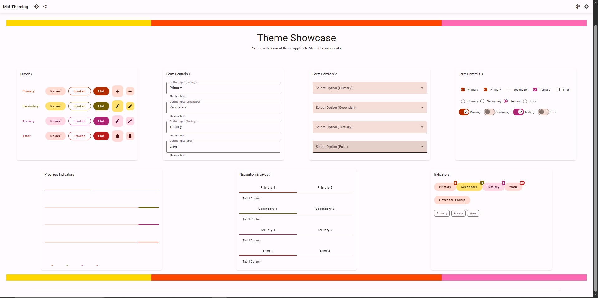

# @moonlight/material/theming/showcase

Secondary entry point of `@moonlight/material/theming`. Import from `@moonlight/material/theming/showcase` to use the theme showcase/demo components.

---

## Overview

The `/showcase` entry point provides Angular components and templates for visually demonstrating how your selected theme applies to a wide range of Angular Material UI elements. It is designed to be used alongside the `MlThemeSelectorComponent` so users can instantly preview the effects of different theme settings on real Material components.

This is ideal for:
- Theme designers and developers who want to see live previews of their theme changes
- Application users who want to choose or customize a theme and immediately see the results

---

## Features

- **Comprehensive Material Demo**: Showcases buttons, form fields, selects, checkboxes, radios, tabs, progress bars, and more
- **Live Theme Preview**: Instantly reflects changes made via the theme selector
- **Easy Integration**: Drop into your demo or settings page for instant feedback
- **Material Design**: Uses Angular Material components for a realistic preview

---

## Installation

This entry point is included with the main package:

```bash
npm install @moonlight/ng/theming
```

---

## Usage

Import the showcase module or component into your demo or settings module:

```typescript
import { ThemeShowcaseComponent } from '@moonlight/material/theming/showcase';

@NgModule({
  declarations: [ThemeShowcaseComponent],
  // ...other config
})
export class DemoModule {}
```

Or use as a standalone component:

```html
<ml-theme-showcase></ml-theme-showcase>
```

### Example Integration

```html
<ml-theme-selector></ml-theme-selector>
<ml-theme-showcase></ml-theme-showcase>
```

This setup allows users to select or customize a theme and immediately see how it looks across all major Material UI elements.

---

## Screenshot



---

## Best Practices

- Place the showcase next to your theme selector for a seamless user experience
- Use in documentation, style guides, or admin panels to preview theme changes
- Extend the showcase with your own custom components if needed

---

## Related Entry Points

- `@moonlight/material/theming/selector` – Theme selection UI component
- `@moonlight/material/theming/components` – Theme/dark mode toggle UI components
- `@moonlight/material/theming/config` – Theme configuration utilities
- `@moonlight/material/theming/service` – Core theme generation and application services

---

## License

MIT
